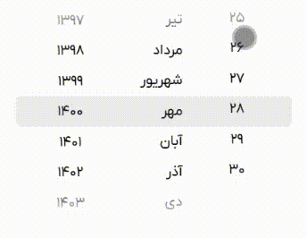

# iOS Jalali DatePicker

A React component for selecting Jalali (Persian) dates with iOS-style picker.

## Installation

```bash
npm install ios-jalali-datepicker
```

## React Compatibility

Compatible with React 16.8+, including **React 19** ✨

- React 16.8+
- React 17.x
- React 18.x
- React 19.x ✅

## Demo



## Usage

```jsx
import React from 'react';
import MonthYearSelector from 'ios-jalali-datepicker';

function App() {
  const handleDateChange = (dateInfo) => {
    console.log('Selected date:', dateInfo);
  };

  return (
    <MonthYearSelector
      onChange={handleDateChange}
      initialDate={new Date()}
    />
  );
}

export default App;
```

## Props

| Prop | Type | Description |
|------|------|-------------|
| onChange | (dateInfo: SelectedDateInfo) => void | Callback function called when date changes |
| initialDate | Date | Initial date to display (optional) |

## Types

```typescript
type SelectedDateInfo = {
  selectedMonthIndex: number;
  selectedYear: number;
  selectedDay: number;
  date: Date;
};
```

## License

MIT 